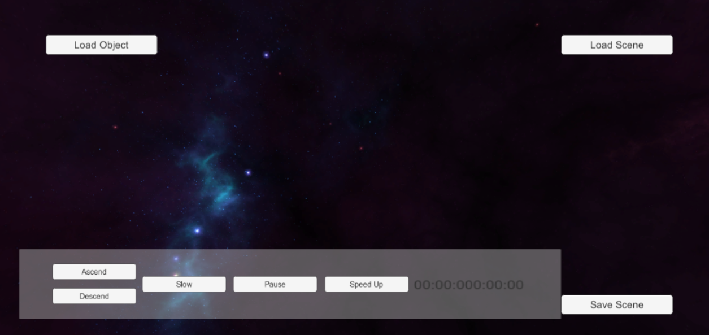
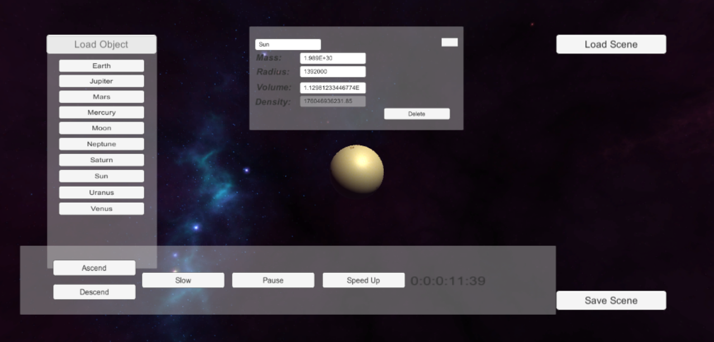
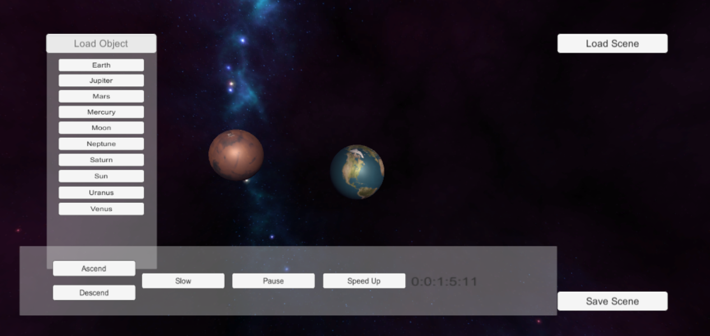

# SpaceSim
Space Simulator written in C# and Unity. Can place any number of celestial objects and simulat physics effects. Can speed up and slow down time, as well as edit the physical properties of objects. Blender models, physics engine, and collision detection system all written by me.

